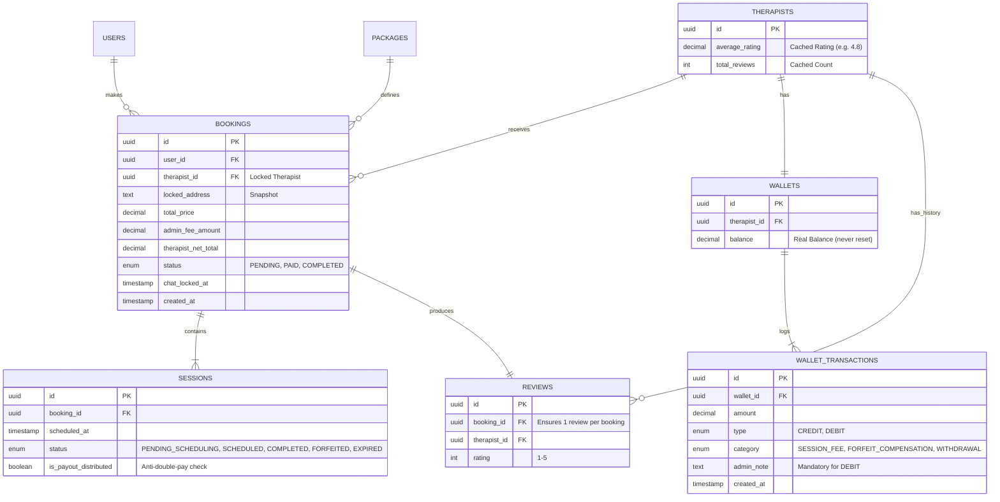

# PROJECT BLUEPRINT: Fisioku Prime Care (Home Visit Physiotherapy App)

## 1. Overview
Aplikasi on-demand fisioterapi home-visit untuk Pasien (Mobile), Terapis (Mobile), dan Admin Dashboard (Web). Fokus: integritas medis, keamanan finansial, efisiensi slot 90 menit, dan arsitektur modular.

## 2. Tech Stack & Architecture
- **Architecture:** Modular Monolith / Microservices (DDD).
- **Backend:** NestJS (TypeScript).
- **Database:** PostgreSQL (transaksi aman wajib).
- **Queue:** BullMQ (Redis) untuk cron/notifications.
- **Mobile:** React Native.
- **Admin:** Next.js.
- **Notification:** Firebase FCM / WhatsApp Gateway.

## 3. Business Rules (Kritis)
### A. Booking & Logistik
- Slot 90 menit (60 terapi + 30 travel); slot pada menit :00 atau :30 (08:00, 09:30, 11:00, dst.).
- Instant booking: slot hari ini dengan lead time > 1 jam.
- Regular package: contoh paket 4 sesi; sesi 1 dijadwalkan, sisanya jadi kuota.
- Locked data: alamat dan therapist_id dikunci di BOOKINGS untuk semua sesi paket.
- Concurrency safety: create booking untuk slot sama harus pakai pessimistic locking atau isolation level SERIALIZABLE agar tidak double booking.
- Profile guard: tolak createBooking bila `user.is_profile_complete = false`.

### B. Pembatalan & Forfeit
- Cancel aman jika > 1 jam sebelum jadwal; kuota kembali ke pasien.
- Forfeit jika cancel < 1 jam atau no-show → status `FORFEITED`; terapis tetap dapat payout pro-rata.

### C. Finansial (Wallet & Revenue)
- Snapshot pricing: simpan `admin_fee_amount` (jika ada) dan `therapist_net_total` saat booking dibuat.
- Payout pro-rata per sesi pada status `COMPLETED` atau `FORFEITED`; gunakan `is_payout_distributed` untuk cegah double pay.
- Wallet display: balance nyata tidak pernah di-reset; monthly stats hanya via query (visual reset).
- Admin transfer/withdraw: DEBIT wajib `admin_note` dan terlihat di riwayat terapis.

### F. Pembayaran (Midtrans Core API)
- Metode: channel Midtrans (VA, QRIS dinamis, e-wallet) via Core API; `order_id` menggunakan `booking.id`, `gross_amount` = `totalPrice`.
- Alur: `POST /payment/initiate` memanggil Midtrans Core, menyimpan token/instruksi/expiry; status booking tetap `PENDING` sampai webhook settlement/capture.
- Webhook: endpoint `POST /webhooks/midtrans` memverifikasi signature; mapping status:
  - `settlement|capture` → booking `PAID`, set `therapist_respond_by`, `chat_locked_at`, notifikasi terapis/pasien.
  - `pending` → simpan instruksi/expiry, tetap `PENDING`.
  - `expire|cancel|deny` → booking `CANCELLED`, `refund_status=PENDING` jika perlu.
- Upload bukti & konfirmasi manual dihapus; rekonsiliasi memakai webhook/idempoten status Midtrans.
- Refund: bila terapis decline/timeout atau payment expire/cancel, set `refund_status=PENDING`; admin menyelesaikan transfer balik dan menandai `refund_status=COMPLETED` dengan reference/note.

### D. Review & Rating
- Dashboard menampilkan `THERAPISTS.average_rating` dan `total_reviews` sebagai cache.
- Submit review harus atomik: insert REVIEWS + update cached rating/count.

### E. Chat & Notifikasi
- Chat dikunci otomatis sesuai `chat_locked_at` (umumnya 24 jam pasca sesi terakhir).
- Notifikasi prioritas untuk instant booking dan event penting (BookingAccepted, PayoutSuccess, dll.).

### G. Acceptance SLA & Timeout
- SLA respon terapis: 5 menit untuk INSTANT, 30 menit untuk REGULAR; `therapist_respond_by` diset saat pembayaran dikonfirmasi.
- Jika melewati SLA tanpa accept, booking otomatis `CANCELLED` + `refund_status=PENDING` dan notifikasi dikirim ke pasien/terapis.
- Accept pertama membuka room chat; decline/timeout memicu refund manual oleh admin.

## 4. Database Schema (ERD)

## 5. Module Specifications
- **Booking**: `createBooking` harus transaksi DB + locking; instant slot query `slot_time > NOW() + INTERVAL '60 minutes'`; enforce locked therapist/address untuk sesi paket.
- **Admin (Ops/Escape Hatch)**: `PATCH /admin/bookings/:id/swap-therapist` dengan `newTherapistId`; update `locked_therapist_id` di BOOKINGS dan `therapist_id` di SESSIONS status `PENDING_SCHEDULING`/`SCHEDULED`; kirim notifikasi ke pasien & terapis lama/baru.
- **Wallet**: `topUpWallet` dalam 1 transaksi: update `SESSIONS.is_payout_distributed`, `WALLETS.balance`, dan insert WALLET_TRANSACTIONS; `getMonthlyIncome` = `SUM(amount)` WHERE type='CREDIT' AND MONTH(created_at)=current_month.
- **Review**: `submitReview` transaksi insert REVIEWS + recalculasi cached `average_rating`/`total_reviews` (SP atau query atomik).
- **Notification**: listener event (BookingAccepted, InstantRequest, PayoutSuccess); push urgent untuk instant booking.

## 6. Automation (Cron/Jobs)
- **handlePackageExpiry** — Harian 00:00: set `sessions.status = EXPIRED` jika `bookings.created_at > 30 hari` dan `sessions.status = PENDING_SCHEDULING` (tanpa payout).
- **handleChatLock** — Tiap 15 menit: set `is_chat_active = false` jika `chat_locked_at < NOW()`.
- **therapist-timeout** — Tiap 5 menit: batalkan booking `PAID` yang melewati `therapist_respond_by`, set `refund_status = PENDING`, kirim notifikasi timeout.
- **payout queue** — Job BullMQ dengan retry/backoff (3x exponential 5s) + event log; dijalankan saat sesi COMPLETED/FORFEITED.
